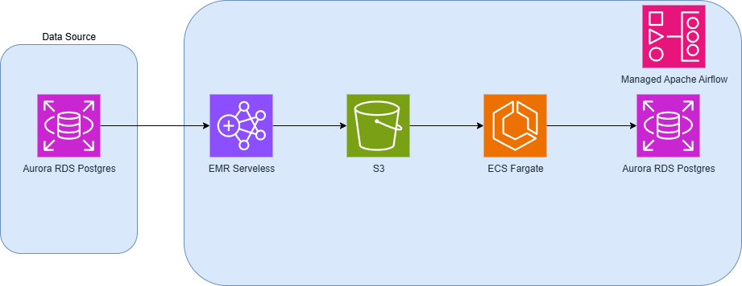

# Serverless-Geospatial-Data-Pipeline-on-AWS
A fully serverless geospatial data pipeline built on AWS for processing and analyzing large volumes of spatial data. This solution integrates AWS managed services with open-source frameworks to create a scalable, efficient, and cost-effective data flow.

## Project Overview
This repository contains the code and infrastructure for a serverless geospatial data pipeline, designed to modernize and optimize an ETL process that was suffering from performance bottlenecks in a PostgreSQL database.

## The Problem
The original system relied on complex Materialized Views to aggregate and transform large volumes of geospatial data. The update process (REFRESH MATERIALIZED VIEW) was:
  - Slow: Took considerable time to complete, resulting in outdated data for extended periods.
  - Resource-Intensive: Consumed excessive CPU and memory from the database, degrading the performance of other queries and applications.

## The Architectural Solution
To solve these problems, the architecture was redesigned to externalize and optimize data processing, following two main strategies:

1. Distributed Processing with Spark & Sedona on EMR Serverless:
The ETL workload was migrated from PostgreSQL to a distributed processing environment.
   - Apache Spark: Used to process data in parallel, ensuring scalability and speed.
    - Apache Sedona: Added as a Spark extension to optimize geospatial data queries and manipulations.
    - AWS EMR Serverless: Chosen as the execution platform to provision compute resources on demand, eliminating the need to manage clusters and optimizing costs.

2. Atomic Update Strategy (Zero Downtime):
To replace materialized views and avoid downtime, a "blue-green deployment" pattern for data was implemented:
    - The pipeline processes the data and materializes the result into a new table in PostgreSQL (e.g., processed_data_v2).
    - A stable VIEW used by clients (e.g., vw_processed_data) continues to point to the old table (processed_data_v1).
    - In a fast and atomic transaction, the VIEW is changed to point to the new table (processed_data_v2).
    - After the view is updated, the old table (processed_data_v1) is dropped (DROP TABLE).

This approach ensures that end users always query a complete and consistent dataset, completely eliminating downtime and inconsistency windows.

## Key Benefits Achieved
  - Reduced Database Load: PostgreSQL was relieved of heavy processing, freeing it for its primary function: serving queries quickly.
  - Faster and More Scalable Updates: Processing time was drastically reduced thanks to the power of Spark and EMR Serverless.
  - High Availability (Zero Downtime): Consumer systems no longer suffer from unavailability during update cycles.
  - Maintainability and Modularity: The ETL code was decoupled from the database, making it easier to test, version, and maintain.

## Technologies

In this project, the following technologies and platforms were used:

  
  
  
  
  
  
  
  
  
  

## Architecture Diagram

